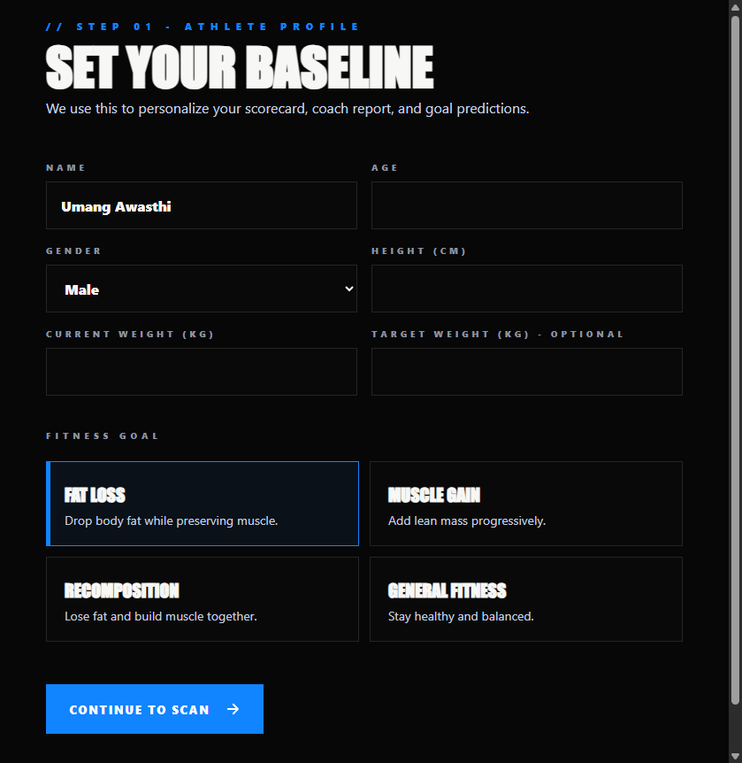
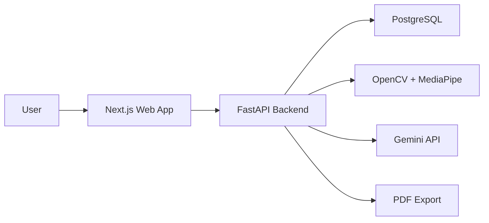

# Physique Meter AI

AI-powered physique analysis and progress tracking platform.

Live website: https://umangawasthi-20.github.io/Physique-Meter/

Repository: https://github.com/UmangAwasthi-20/Physique-Meter

## Features

- Login and signup flow
- User dashboard
- Progress history
- Dark mode UI
- Mobile responsive layout
- AI physique report
- Strengths and weaknesses
- Suggested focus areas
- Weekly progress summary
- Progress photo timeline
- Weight graph
- PDF report export
- Transformation comparison view
- Goal tracker

Example AI report:

> Your shoulder-to-waist ratio appears improved compared to the previous upload. Upper chest development is lagging behind shoulder development, so prioritize incline pressing and controlled volume.

## Tech Stack

- Frontend: Next.js, React, TypeScript
- Backend: FastAPI, Python
- Database: PostgreSQL
- Computer vision: OpenCV, MediaPipe
- AI: Gemini API
- Export: ReportLab PDF
- Current live static demo: GitHub Pages

## Screenshots

The current GitHub Pages demo starts with the dark baseline onboarding screen and then opens the physique scorecard.



## Architecture



More detail: [docs/architecture.md](docs/architecture.md)

Demo video script: [docs/demo-video-script.md](docs/demo-video-script.md)

## Project Structure

- `index.html` - live GitHub Pages static demo
- `frontend/index.html` - exported static frontend copy
- `apps/web` - portfolio Next.js frontend
- `apps/api` - FastAPI backend with AI, CV, progress, auth, and PDF routes
- `database/schema.sql` - PostgreSQL schema
- `shared/physique.js` - shared physique metrics calculator
- `docs` - architecture and demo materials
- `.github/workflows/pages.yml` - GitHub Pages deployment workflow

## Run Static Demo

Open `index.html` directly in a browser, or visit:

```text
https://umangawasthi-20.github.io/Physique-Meter/
```

## Run Next.js Frontend

```bash
cd apps/web
npm install
npm run dev
```

Open:

```text
http://localhost:3000
```

## Run FastAPI Backend

```bash
python -m venv .venv
.venv\Scripts\activate
pip install -r apps/api/requirements.txt
uvicorn apps.api.app.main:app --reload --port 8000
```

Open API docs:

```text
http://localhost:8000/docs
```

## Run PostgreSQL

```bash
docker compose up -d
```

Copy `.env.example` to `.env` and add your real `GEMINI_API_KEY`.

## API Highlights

- `POST /auth/signup`
- `POST /auth/login`
- `POST /analysis/metrics`
- `POST /analysis/photo`
- `POST /analysis/report`
- `GET /progress/history`
- `GET /reports/latest.pdf`

## Deployment Notes

The current live website deploys the static `index.html` through GitHub Pages.

For production full-stack deployment:

- Deploy `apps/web` to Vercel or another Next.js host.
- Deploy `apps/api` to Render, Railway, Fly.io, or a VM.
- Use managed PostgreSQL.
- Store `GEMINI_API_KEY`, `DATABASE_URL`, and `JWT_SECRET` as environment secrets.
