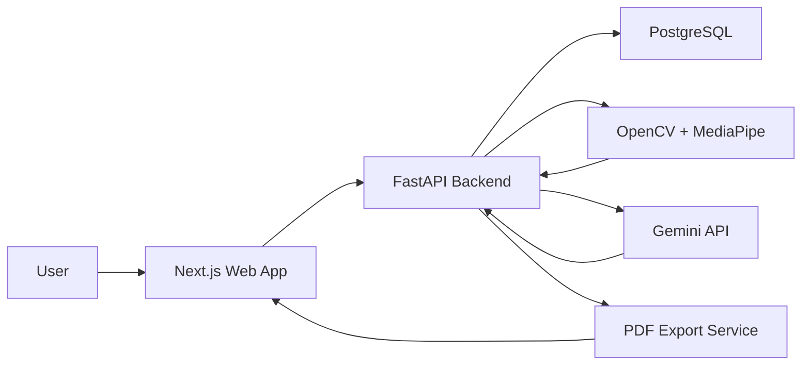

# Architecture

## Data Flow

1. User signs up and creates an athlete baseline.
2. User uploads progress photos and weight/body metrics.
3. FastAPI stores progress entries in PostgreSQL.
4. OpenCV/MediaPipe extracts pose and proportion signals from photos.
5. Gemini generates strengths, weaknesses, focus areas, and weekly summaries.
6. The web dashboard displays charts, photo timeline, comparisons, and exports PDF reports.
