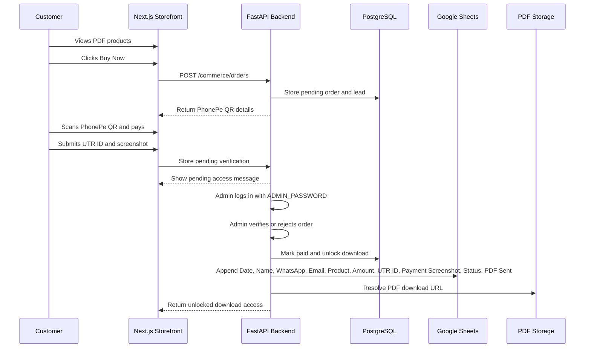

# PDF Product Commerce Flow

## Products

| Product | Price |
| --- | ---: |
| Weight Gain Shake PDF | ₹49 |
| Vegetarian Muscle Gain Guide | ₹99 |

## Google Sheet Columns

| Date | Name | WhatsApp | Email | Product | Amount | UTR ID | Payment Screenshot | Status | PDF Sent |
| --- | --- | --- | --- | --- | ---: | --- | --- | --- | --- |

Status options:

- Pending
- Verified
- Rejected
- PDF Sent

## Recommended Production Setup

- Use PhonePe Payment Gateway callbacks for automatic verification when available.
- Keep QR/manual confirmation as a simple first version for India.
- Store PDFs in Google Drive, Cloudinary, or AWS S3.
- Sync every paid lead to Google Sheets.
- Keep customer phone optional.
